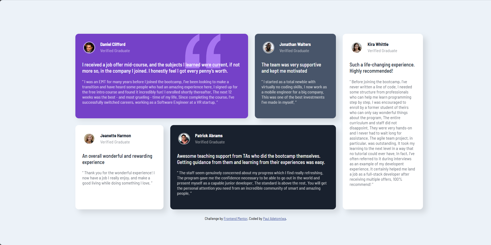

# Frontend Mentor - Testimonials grid section solution

This is a solution to the [Testimonials grid section challenge on Frontend Mentor](https://www.frontendmentor.io/challenges/testimonials-grid-section-Nnw6J7Un7). Frontend Mentor challenges help you improve your coding skills by building realistic projects. 

## Table of contents

- [Overview](#overview)
  - [Screenshot](#screenshot)
  - [Links](#links)
- [My process](#my-process)
  - [Built with](#built-with)
  - [What I learned](#what-i-learned)
- [Author](#author)

## Overview

- This is a solution to a testimonial grid section challenge on Frontend Mentor. It was made to be responsive, with the ability to view the optimal layout depending on their device's screen size. Also, hovering with the cursor on this webpage on some elements activate their focus states.

### Screenshot



### Links

- https://github.com/PaulAdetomiwa/testimonials-grid-section/blob/main/index.html

## My process

### Built with

- Semantic HTML5 markup
- CSS custom properties
- CSS Grid
- CSS Flexbox 
- Media queries

### What I learned

```css
@media (max-width: 1300px) {
      .main {
        width: 90%;
      }
    }

    @media (max-width: 1080px) {
      body {
        font-size: 11px;
      }

      .main {
        width: 90%;
      }
    }

    @media (max-width: 845px) {
      body {
        font-size: 9px;
      }

      .main {
        width: 90%;
      }
    }

    @media (max-width: 768px) {
      body {
        font-size: 13px;
      }

      .main {
        width: 90%;
        margin: 50px auto;
      }

      .container {
        grid-template-columns: 1fr;
        grid-template-rows: auto;
        height: auto;
      }

      .first-half {
        grid-template-rows: auto;
      }

      .top, .bottom {
        grid-template-columns: 1fr;
        grid-template-rows: auto;
      }

      .first-quarter,
      .second-quarter,
      .third-quarter,
      .fourth-quarter,
      .fifth {
        height: auto;
        min-height: 250px;
        padding: 10px;
      }

      .fifth {
        margin-top: 10px;
      }
    }

    @media (max-width: 480px) {
      .main {
        width: 100%;
        margin: 20px auto;
      }

      .container {
        gap: 10px;
      }

      .author img {
        width: 25px;
        height: 25px;
      }

      .qtext1, .qtext2, .qtext3, .qtext4, .qtext5 {
        padding: 10px;
        font-size: 12px;
      }

      .review {
        font-size: 13px;
      }
    }
```
- I had to create multiple media queries because the layout kept falling apart upon resizing the webpage.

- The width and heights of the elements were set using responsiveness-friendly metrics, mostly percentages.

## Author

- Website - [Paul Adetomiwa](https://github.com/PaulAdetomiwa)
- Frontend Mentor - [@PaulAdetomiwa](https://www.frontendmentor.io/profile/PaulAdetomiwa)
- X - [@AdewolePaul6](https://www.x.com/AdewolePaul6)